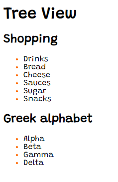
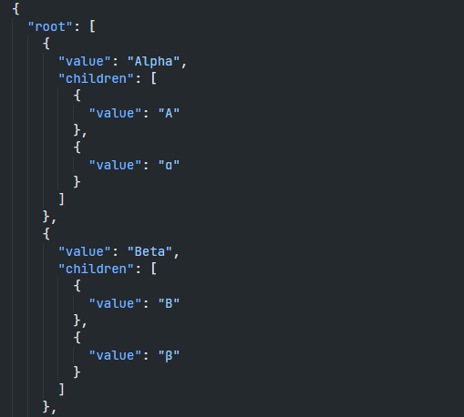

# Web Component TreeView
This TreeView uses `.JSON` files which are used for storing the data that's going to be displayed.\
It is possible to display multiple TreeViews with different `.JSON` files.\
\
